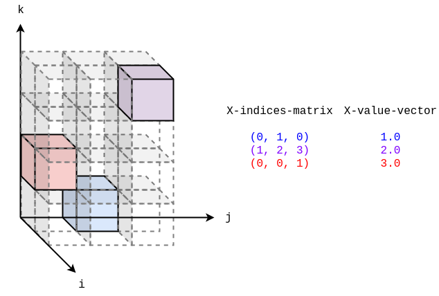

[](https://github.com/masatoi/cl-tensor-decomposition/actions/workflows/test.yml)

# cl-tensor-decomposition

- Non-negative tensor decomposition implementation for Common Lisp
- Update algorithm: Multiplicative Update (MU) for minimization of KL divergence
- Support sparse tensor only

## Installation
```lisp
ros install masatoi/cl-tensor-decomposition
```

## Usage
```lisp
(in-package :cltd)

;; Prepare sparse tensor

(defparameter X-shape '(2 3 4))
(defparameter number-of-non-zero-elements 3)
(defparameter X-indices-matrix
  (make-array (list number-of-non-zero-elements
                    (length X-shape))
              :element-type 'fixnum
              :initial-contents '((0 1 0) ; The row corresponds a element of one datum
                                  (1 2 3)
                                  (0 0 1))))
(defparameter X-value-vector
  (make-array number-of-non-zero-elements
              :element-type 'double-float
              :initial-contents '(1.0 2.0 3.0)))

;; Decomposition

(decomposition X-shape X-indices-matrix X-value-vector :n-cycle 10 :R 2 :verbose t)

#|
cycle: 1, kl-divergence: 9.594987
cycle: 2, kl-divergence: 8.59509
cycle: 3, kl-divergence: 5.7237873
cycle: 4, kl-divergence: 1.3804492
cycle: 5, kl-divergence: 0.94020593
cycle: 6, kl-divergence: 0.78665006
cycle: 7, kl-divergence: 0.74955434
cycle: 8, kl-divergence: 0.7494588
cycle: 9, kl-divergence: 0.74934554
cycle: 10, kl-divergence: 0.7493448
#(#2A((0.0 1.2894418) (0.73389024 0.0))
  #2A((4.4436022e-24 1.333183) (6.0661177e-22 0.44439435) (1.7189547 0.0))
  #2A((1.1754372e-39 0.4362844)
      (2.2280646e-43 1.3088531)
      (0.0 0.0)
      (1.585384 0.0)))
|#
```

## Testing
```lisp
(asdf:test-system :cl-tensor-decomposition)
```

## Reporting

After running `cltd:decomposition`, you can summarise the factors with the reporting helpers:

```lisp
(defparameter *metadata*
  (list (cltd:make-mode-metadata :purchase '("purchase" "not_purchase")
                                 :role :purchase
                                 :discretization "binary flag")
        (cltd:make-mode-metadata "genre" *genre-names*
                                 :discretization "top categories")))

(defparameter *factor-matrices*
  (cltd:decomposition X-shape X-indices-matrix X-value-vector :n-cycle 50 :R 3))

;; Optional: smoothed KL convergence
(multiple-value-bind (factors iterations)
    (cltd:decomposition X-shape X-indices-matrix X-value-vector
                        :n-cycle 200 :R 3
                        :convergence-threshold 1d-4
                        :convergence-window 5)
  (declare (ignore factors))
  (format t "stopped after ~a iterations~%" iterations))

(defparameter *cards*
  (cltd:generate-factor-cards *factor-matrices*
                              X-indices-matrix
                              X-value-vector
                              *metadata*))

;; Serialize with your preferred JSON encoder, e.g. cl-json:
;; (with-open-file (out #P"factor_cards.json" :direction :output :if-exists :supersede :if-does-not-exist :create)
;;   (cl-json:encode *cards* :stream out))

(cltd:generate-report-artifacts *factor-matrices*
                                X-indices-matrix
                                X-value-vector
                                *metadata*
                                :json-serializer (lambda (data stream)
                                                   (cl-json:encode data :stream stream))
                                :factor-json-path #P"factor_cards.json"
                                :report-path #P"report.md")
```

`generate-factor-cards` returns nested alists; pass them to your JSON library of choice. `generate-report-artifacts` optionally accepts `:json-serializer` (a function of `(cards stream)`) so you can control JSON encoding, and always emits a human-oriented `report.md`.

Set `:convergence-threshold` to enable early stopping based on a moving-average KL divergence check; the primary return value remains the factor matrices, and the secondary return value reports how many iterations actually ran.

## Rank Selection

Use `select-rank` for k-fold cross-validation over candidate ranks:

```lisp
(multiple-value-bind (best all-results)
    (cltd:select-rank X-indices-matrix X-value-vector
                      '(5 10 15)
                      :k 3
                      :n-cycle 50
                      :convergence-threshold 1d-4
                      :convergence-window 5
                      :random-state (make-random-state t))
  (format t "best rank: ~a with mean KL ~,5f~%"
          (cdr (assoc :rank best))
          (cdr (assoc :mean best)))
  all-results)

(multiple-value-bind (factors iterations)
    (cltd:decomposition X-shape X-indices-matrix X-value-vector
                        :R (cdr (assoc :rank best))
                        :convergence-threshold 1d-4
                        :convergence-window 5)
  (declare (ignore iterations))
  factors)
```

`cross-validate-rank` returns detailed fold statistics if you need manual inspection; pass your own evaluation function to use RMSEやMAEなど別指標。

### Model of a sparse tensor
A sparse tensor consists of pairs of non-zero values and indices.


## Reference

- [Multiple Data Analysis and Non-negative Matrix/Tensor Factorization [II. Finish] : Tensor Data Analysis and Applications](http://www.kecl.ntt.co.jp/icl/ls/members/tatsushi/PDF/IEICE_vol99_no7_691-698.pdf)
