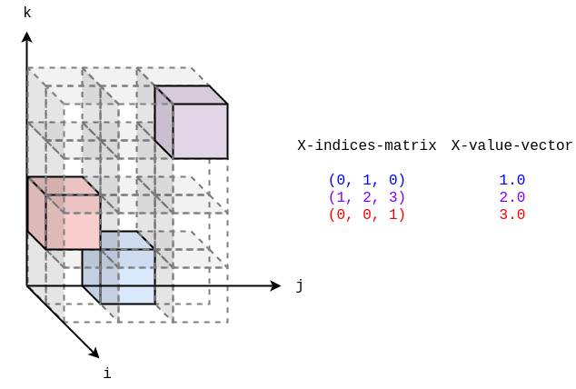

[](https://github.com/masatoi/cl-tensor-decomposition/actions/workflows/test.yml)

# cl-tensor-decomposition

- Non-negative tensor decomposition implementation for Common Lisp
- Update algorithm: Multiplicative Update (MU) for minimization of KL divergence
- Support sparse tensor only

## Installation
```lisp
ros install masatoi/cl-tensor-decomposition
```

## Usage
```lisp
(in-package :cltd)

;; Prepare sparse tensor data

(defparameter *shape* '(2 3 4))
(defparameter *nnz* 3)  ; number of non-zero elements

(defparameter *indices*
  (make-array (list *nnz* (length *shape*))
              :element-type 'fixnum
              :initial-contents '((0 1 0)   ; each row is a coordinate
                                  (1 2 3)
                                  (0 0 1))))

(defparameter *values*
  (make-array *nnz*
              :element-type 'double-float
              :initial-contents '(1d0 2d0 3d0)))

;; Create sparse tensor (validates input)
(defparameter *tensor*
  (make-sparse-tensor *shape* *indices* *values*))

;; Run decomposition
(decomposition *tensor* :n-cycle 10 :r 2 :verbose t)

#|
iteration: 1, kl-divergence: 8.224610, kkt-residual: 3.463d+0
iteration: 2, kl-divergence: 4.664016, kkt-residual: 1.851d+0
iteration: 3, kl-divergence: 2.355427, kkt-residual: 8.964d-1
iteration: 4, kl-divergence: 2.249334, kkt-residual: 9.448d-2
iteration: 5, kl-divergence: 2.249334, kkt-residual: 4.010d-6

;; stopped after 5 of 10 allowed iterations: the KKT residual reached 1d-4
#(#2A((3.99999 0.00000) (0.00000 1.99999))
  #2A((0.75000 0.00000) (0.25000 0.00000) (0.00000 1.00000))
  #2A((0.25000 0.00000) (0.75000 0.00000) (0.00000 0.00000) (0.00000 1.00000)))
|#
```

## Testing
```lisp
(asdf:test-system :cl-tensor-decomposition)
```

## Reporting

After running `decomposition`, you can summarise the factors with the reporting helpers:

```lisp
;; Create tensor with domain metadata
(defparameter *tensor*
  (make-sparse-tensor *shape* *indices* *values*
    :domains (list
              (make-mode-metadata "purchase" '("yes" "no")
                                  :role :purchase
                                  :positive-label "yes"
                                  :negative-label "no"
                                  :discretization "binary outcome")
              (make-mode-metadata "genre" *genre-names*
                                  :role :product
                                  :discretization "top categories"))))

;; Run decomposition with early stopping
(multiple-value-bind (factors iterations)
    (decomposition *tensor*
                   :r 3
                   :n-cycle 200
                   :convergence-threshold 1d-4
                   :convergence-window 5)
  (format t "Converged after ~a iterations~%" iterations)

  ;; Generate factor cards
  (let* ((indices (sparse-tensor-indices *tensor*))
         (values (sparse-tensor-values *tensor*))
         (domains (sparse-tensor-domains *tensor*))
         (cards (generate-factor-cards factors indices values domains)))

    ;; Write JSON and markdown report
    (generate-report-artifacts factors indices values domains
                               :json-serializer #'cl-json:encode-json
                               :factor-json-path #P"factor_cards.json"
                               :report-path #P"report.md")))
```

### Mode Metadata

`make-mode-metadata` creates descriptive metadata for each tensor mode:

| Parameter | Description |
|-----------|-------------|
| `name` | Mode name (string or symbol) |
| `labels` | List of category labels |
| `:discretization` | How the mode was discretized (e.g., "quartiles", "binary") |
| `:role` | Semantic role (e.g., `:purchase`, `:demographic`, `:temporal`) |
| `:positive-label` | Label for positive outcome in binary modes |
| `:negative-label` | Label for negative outcome in binary modes |

These fields are reflected in factor cards as `:mode_roles`, `:purchase_bias`, and `:notes`.

### Output

`generate-factor-cards` returns nested alists; pass them to your JSON library of choice. `generate-report-artifacts` optionally accepts `:json-serializer` (a function of `(data stream)`) so you can control JSON encoding, and always emits a human-oriented `report.md`.

Set `:convergence-threshold` to enable early stopping based on a moving-average KL divergence check; the primary return value remains the factor matrices, and the secondary return value reports how many iterations actually ran.

## Rank Selection

Use `select-rank` for k-fold cross-validation over candidate ranks. It takes the
`sparse-tensor` itself, so the declared shape and the mode metadata survive into
every fold:

```lisp
(multiple-value-bind (best all-results)
    (select-rank *tensor*
                 '(5 10 15)
                 :k 5
                 :n-cycle 50
                 :convergence-threshold 1d-4
                 :convergence-window 5
                 :random-state (make-random-state t))
  (format t "Best rank: ~a with mean score ~,5f~%"
          (cdr (assoc :rank best))
          (cdr (assoc :mean best)))

  ;; Run final decomposition with best rank
  (decomposition *tensor*
                 :r (cdr (assoc :rank best))
                 :convergence-threshold 1d-4
                 :convergence-window 5))
```

`cross-validate-rank` returns the same per-rank statistics if you want to inspect
them yourself. Each entry carries `:rank`, `:mean`, `:std`, `:standard-error`,
`:scores` and `:validation-counts`, in the order the ranks were given. Neither
function sorts that list in place. `select-rank-1se` picks the smallest rank
whose mean is within one standard error (`std / sqrt(k)`) of the best.

### Stopping at the elbow

`select-rank-elbow` walks the candidates upward and stops once a rank stops
paying for itself, instead of fitting the whole grid:

```lisp
(multiple-value-bind (best evaluated)
    (select-rank-elbow *tensor* '(1 2 4 8 16 32)
                       :k 5 :n-cycle 200
                       :random-state (make-random-state t))
  (format t "rank ~a after fitting only ~a of 6 candidates~%"
          (cdr (assoc :rank best)) (length evaluated)))
```

After each rank it compares the improvement with the noise in that score:

```
gain  = mean[best] - mean[rank]
noise = tolerance * standard-error[rank]     ; tolerance defaults to 1
```

A gain above the noise makes that rank the new best; otherwise a counter
advances, and the sweep stops after `:patience` consecutive ranks fail to pay.
This is a sequential form of the 1-SE rule, so it tends to agree with
`select-rank-1se` while fitting fewer models. Measured on an 8-rank grid it
selected the same rank as both `select-rank` and `select-rank-1se` while
evaluating 25–62 % fewer ranks:

| data | true rank | elbow | argmin | 1-SE | ranks skipped |
|---|---|---|---|---|---|
| synthetic, rank 2 | 2 | 2 | 2 | 2 | 62 % |
| synthetic, rank 4 | 4 | 4 | 4 | 4 | 38 % |
| Palmer Penguins | — | 3 | 3 | 3 | 33 % |

Two things to know. The second return value covers only the ranks the sweep
reached — unlike `select-rank` and `select-rank-1se`, which always return the
whole grid — and it carries no repeats, since duplicate candidates are collapsed
before the sweep. And the rule is greedy: it assumes the curve falls to an elbow
and then flattens, so a curve that plateaus and improves again much later would
be cut short — raise `:patience`, or use `cross-validate-rank` when the whole
curve matters.

### How the folds are built

Counts are **not** split by coordinate. Holding out whole coordinates would be
invalid here: an unstored coordinate is an observed zero, so the training tensor
would present each held-out cell as a zero and the model would then be scored on
recovering a positive count it was fitted to suppress.

Instead every *event* is assigned to a fold uniformly at random — Poisson (
multinomial) thinning:

```
(V_i^1, ..., V_i^k) | X_i  ~  Multinomial(X_i; 1/k, ..., 1/k)
```

Fold `f` trains on `T_i^f = X_i - V_i^f` and validates on `V_i^f`, so the same
cell appears in both halves. Under Poisson thinning the two halves are
independent Poisson samples. Training exposure is `(k-1)/k`, validation exposure
is `1/k`.

Because the fit sees the training exposure, validation predictions are scaled by
the exposure ratio `s = 1/(k-1)` — applied to the stored-coordinate predictions
*and* to the model's total predicted mass, via
`(sparse-kl-divergence ... :prediction-scale s)`.

The default fold score is the generalized KL per validation event:

```
score_f = D(V^f || s * T^^f) / sum_i V_i^f
```

Lower is better. This is not the Poisson deviance — the deviance is twice this.

This requires **non-negative integer counts**; fractional values are rejected
rather than truncated.

`k` must be at least 2, and the tensor must hold enough events that an empty fold
is negligible. A fold is empty with probability `(1-1/k)^N`, so by the union
bound `P(some fold empty) <= k*(1-1/k)^N`; the accepted range is where that stays
under `1e-6`:

```
N >= ln(k / 1e-6) / ln(k / (k-1))
```

| `k` | 2 | 3 | 5 | 10 | 20 | 50 |
|---|---|---|---|---|---|---|
| minimum events | 21 | 37 | 70 | 153 | 328 | 878 |

The bound matters because a fold with no validation events has no score and a
fold with no training events has no model, so `make-poisson-folds` redraws until
every fold has both. Redrawing *conditions* the multinomial, so it is only
harmless where it essentially never happens — hence a tolerance rather than a
mere feasibility check. (At the weaker "succeeds more often than not" bound about
40% of draws would be discarded, and `k=2` with 2 events could return only the
balanced 1/1 split, erasing the count variability the scores and standard errors
exist to measure.) Smaller tensors are rejected up front with the shortfall named.

The bound is on the **event count**, not on the number of stored non-zeros: a
single cell holding 100 events splits into 5 folds perfectly well.

`make-poisson-folds` exposes the split directly if you need it:

```lisp
(let ((folds (make-poisson-folds *tensor* 5 :random-state (make-random-state t))))
  (poisson-folds-prediction-scale folds)      ; => 0.25d0
  (multiple-value-bind (train valid train-total valid-total)
      (poisson-fold-tensors folds 0)
    ...))
```

### Custom fold metrics

`:evaluation-function` receives everything a metric needs to apply the exposure
correction itself:

```lisp
(lambda (validation-tensor approximation factor-matrix-vector
         prediction-scale validation-count)
  ...)
```

`approximation` holds the reconstruction at the validation coordinates *at the
training exposure*, so a metric that compares against `validation-count` must
scale it by `prediction-scale`. The default, `normalized-generalized-kl`, does
exactly that.

### Reproducibility

A single `:random-state` drives both the thinning and each fold's factor
initialization, and it is copied rather than advanced, so passing the same state
twice gives identical results. The folds are drawn once and shared by every
candidate rank, and each fold's initialization is fixed in advance, so reordering
`ranks` cannot change any rank's scores.

Nothing is printed unless `:verbose t`.

### Model of a sparse tensor
A sparse tensor consists of pairs of non-zero values and indices.


A coordinate that is absent from the index matrix is an **observed zero**, not a
missing value. There is no observation mask: the tensor is dense in meaning and
sparse only in storage.

### The optimizer

One `:n-cycle` is a **full sweep**: every mode is updated once, with the
reconstruction refreshed between modes. It used to count single-mode updates, so
the same number now does as much work as there are modes — a `:n-cycle 100` on a
3-mode tensor is 300 mode updates, not 100. It must be a non-negative integer;
`0` runs no updates but still returns the initial model in the representation
described below, with normalized columns, real weights and a real loss.

**Convergence** is decided by the KKT residual, not only by the loss curve. At a
solution of the non-negativity constrained problem every factor entry satisfies

```
A >= 0        gradient >= 0        A * gradient = 0
```

so `max |min(A, gradient)|` is zero exactly at a stationary point, where the
gradient of the generalized KL with respect to `A(i,r)` is
`denominator(r) - numerator(i,r)`. The run stops when that falls below
`:kkt-tolerance` (default `1d-4`, following Chi & Kolda); pass `0` to disable it
and use the whole budget.

A sweep observes that residual for free, since each update already has the
gradients — but each mode reports what it saw **on entry**, so once the sweep has
updated every mode and normalized the columns those numbers describe states that
no longer exist. The free value therefore only acts as a screen. When it trips,
and once more before returning, the residual is recomputed against the settled
model; that is what convergence is decided on and what the seventh return value
means. A run that exhausts `:n-cycle` on a model that already satisfies the
tolerance reports `converged-p` true, because the settled residual — not the
screen — has the last word.

The older `:convergence-threshold` moving-average test still works and still
stops the run, but it is weak on its own: averaging over a window dilutes the
step-to-step change, so a larger `:convergence-window` reports convergence
sooner — including on runs that have not converged.

**Inadmissible zeros.** A multiplicative step is a product, so an entry that
reaches zero can never come back, and the fit can stall at a point that is not
KKT. Following [Chi & Kolda](https://arxiv.org/abs/1112.2414), an entry that is
pinned at zero (below `:kappa-tolerance`) while its gradient is negative — it
wants to grow — is nudged to `:kappa` (default `1d-2`) before the step. The
first sweep runs without this, matching their `k > 1` condition.

This fixes a single pinned entry. A *coordinated* collapse, where the matching
entries in several modes are zero together, is a genuine boundary stationary
point rather than a missed fix — a poor local optimum, which is what `:n-starts`
is for.

**Normalization and component weights.** After each sweep the columns are scaled
to unit sum and the scale collected into an explicit weight per component, then
folded back into mode 0. So the returned factors have unit-sum columns in every
mode past the first, mode 0 carries the weights, and `sdot` still reads them
directly. The weights come back as the sixth return value and sum to the total
predicted mass.

**Multiple starts.** Multiplicative updates only find a local optimum.
`:n-starts` (default 1) runs that many random initializations and keeps the one
with the lowest final KL.

**Health checks.** A NaN or infinite factor entry signals
`numerical-instability-error`, naming the mode, row and column. The factors are
scanned before the iteration starts and again after each sweep's updates, before
normalization can divide by a bad value and before `sdot` and the loss carry it
further. On SBCL the IEEE traps are masked across the iteration so the arithmetic
produces the bad value instead of trapping on it, which is what lets the library
report where it came from rather than surfacing an implementation condition.

Aggregates get their own check, because entries that are each finite can still
sum or multiply past the double range: a column sum, a component weight, or the
KKT residual itself. Each signals `numerical-instability-error` naming what
overflowed, rather than dividing by an infinity and sending zeros and NaNs on
into the reconstruction. The residual is computed after the loop but under the
same trap mask, since it divides observed counts by the reconstruction and can
overflow on exactly the inputs the sweep can. A component whose weight collapses is different —
it usually just means the rank is larger than the data supports, which is what a
rank sweep is looking for — so `:on-dead-component` chooses `:warn` (default),
`:error`, or `:ignore`.

```lisp
(multiple-value-bind (factors iterations final-kl kl-history converged-p
                      lambda kkt-residual)
    (decomposition *tensor* :r 5 :n-cycle 200 :n-starts 4)
  (format t "~a iterations, KL ~,4f, KKT ~,3e, weights ~a~%"
          iterations final-kl kkt-residual lambda))
```

### Objective function

`decomposition` minimises the generalized (Poisson) KL divergence between the
observed tensor and its CP reconstruction:

```
D(X||X^) = sum_i [ x_i * log(x_i / x^_i) - x_i + x^_i ]
```

The sum runs over *every* coordinate, so the implicit zeros contribute their
full reconstruction mass. `sparse-kl-divergence` evaluates it in two parts:

```
D(X||X^) = sum_{i in nnz} [ x_i * log(x_i / x^_i) - x_i ]  +  sum_i x^_i
```

The second term is the total predicted mass, aggregated straight from the CP
structure rather than by expanding the tensor:

```
sum_i x^_i = sum_r prod_m ( sum_j A^(m)_{j,r} )
```

which costs `O(R * sum_m I_m)` and allocates no dense array. Because that term
depends on the factor matrices, `sparse-kl-divergence` takes them as a fourth
argument:

```lisp
(let ((x-hat (make-array (length values) :element-type 'double-float
                         :initial-element 0d0)))
  (sdot factors indices x-hat)
  (sparse-kl-divergence indices values x-hat factors))
```

`x-hat` and `factors` must describe the same model state, so call `sdot` after
every factor update. The optional `:prediction-scale` multiplies every
prediction — both the stored-coordinate values and the total mass — which is how
cross-validation corrects for the exposure difference between a fold's training
and validation halves.

The logarithm divides by `x^ + *epsilon*` so an underflowed reconstruction
cannot yield `-infinity`; `*epsilon*` is not added to the total predicted mass.

`:kappa`, `:kappa-tolerance` and `:kkt-tolerance` accept any real — they are
coerced to double-float at the API boundary — so `:kappa 0` disables the
inadmissible-zero fix without ceremony.

## Reference

- [Multiple Data Analysis and Non-negative Matrix/Tensor Factorization [II. Finish] : Tensor Data Analysis and Applications](http://www.kecl.ntt.co.jp/icl/ls/members/tatsushi/PDF/IEICE_vol99_no7_691-698.pdf)
